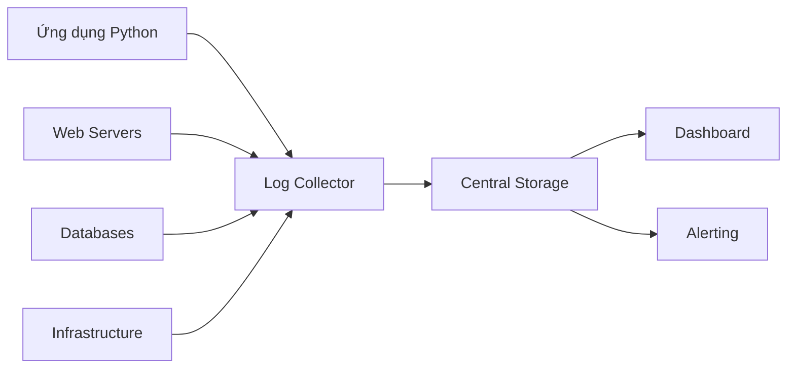

# 📊 Logging trong Thực tế: Các Công ty Làm Gì với Logs

## 📋 Mục lục
- [🎯 Khi nào cần Logging](#-khi-nào-cần-logging)
- [🔍 Họ thường làm gì với Logs](#-họ-thường-làm-gì-với-logs)
- [💡 Tại sao Logging quan trọng](#-tại-sao-logging-quan-trọng)
- [🏢 Cách tổ chức Logging trong Enterprise](#-cách-tổ-chức-logging-trong-enterprise)
- [📈 Monitoring & Alerting thực tế](#-monitoring--alerting-thực-tế)
- [💾 Lưu trữ & Retention](#-lưu-trữ--retention)
- [🌍 Ví dụ thực tế từ các công ty lớn](#-ví-dụ-thực-tế-từ-các-công-ty-lớn)

---

## 🎯 Khi nào cần Logging

### **1. Development & Debugging**
**Khi nào:** Trong quá trình phát triển và debug
```python
# Khi viết code mới
logger.info("Starting data processing pipeline")

# Khi test từng bước
logger.debug("Processing batch 1/10")
logger.debug("Applying transformation rule X")

# Khi có lỗi
logger.error("Failed to connect to database", extra={
    'error_code': 'CONNECTION_TIMEOUT',
    'retry_count': 3
})
```

### **2. Production Monitoring**
**Khi nào:** Khi ứng dụng đã deploy và chạy real-time
```python
# Track business metrics
logger.info("Order processed successfully", extra={
    'order_id': '12345',
    'amount': 299.99,
    'processing_time': 1.2
})

# Monitor system health
logger.warning("High memory usage detected", extra={
    'memory_percent': 85,
    'threshold': 80
})
```

### **3. Data Quality Tracking**
**Khi nào:** Trong data pipelines để track chất lượng dữ liệu
```python
# Track data quality issues
logger.warning("Data quality issue", extra={
    'table': 'customer_data',
    'issue': 'missing_emails',
    'affected_rows': 150,
    'quality_score': 0.85
})
```

---

## 🔍 Họ thường làm gì với Logs

### **1. Tập trung Logs từ nhiều nguồn**
- **Application Logs**: Từ các Python scripts, web servers
- **System Logs**: Từ OS, containers, databases
- **Infrastructure Logs**: Từ AWS, Docker, Kubernetes

### **2. Visualize và Dashboard**
- **Real-time Dashboards**: Xem tình trạng hệ thống ngay lập tức
- **Historical Trends**: Phân tích patterns theo thời gian
- **Alert Dashboards**: Monitor các metrics quan trọng

### **3. Set up Alerting**
- **Email Alerts**: Khi có lỗi nghiêm trọng
- **Slack Notifications**: Thông báo nhóm dev
- **PagerDuty**: Alert on-call engineers

### **4. Analyze và Report**
- **Error Analysis**: Tìm patterns lỗi thường gặp
- **Performance Reports**: Báo cáo hiệu suất hàng tuần
- **Business Insights**: Từ logs suy ra insights kinh doanh

---

## 💡 Tại sao Logging quan trọng

### **1. Business Perspective**

#### **🚨 Risk Mitigation**
- **Financial Impact**: Một giờ downtime có thể mất hàng triệu đô
- **Reputation Damage**: Customer experience bị ảnh hưởng
- **Compliance Violations**: Không tuân thủ regulations

#### **📊 Data-Driven Decisions**
- **Performance Optimization**: Biết điểm nghẽn ở đâu
- **Capacity Planning**: Dự đoán khi nào cần scale up
- **Cost Optimization**: Tìm cách giảm chi phí infrastructure

### **2. Technical Perspective**

#### **🔧 Debugging Efficiency**
```python
# Không có logging - phải guess vấn đề
# Với logging - biết chính xác chuyện gì xảy ra
logger.error("Pipeline failed", extra={
    'stage': 'data_ingestion',
    'error_type': 'connection_timeout',
    'records_processed': 50000,
    'correlation_id': 'abc123'
})
```

#### **📈 System Observability**
- **Know what's happening**: Biết hệ thống đang làm gì
- **Predict failures**: Phát hiện vấn đề trước khi nghiêm trọng
- **Understand usage patterns**: Hiểu cách users sử dụng hệ thống

#### **🔒 Security & Compliance**
- **Audit Trails**: Theo dõi ai làm gì, khi nào
- **Security Monitoring**: Phát hiện suspicious activities
- **Regulatory Compliance**: Đáp ứng yêu cầu pháp lý

---

## 🏢 Cách tổ chức Logging trong Enterprise

### **1. Centralized Logging Architecture**

#### **Thu thập Logs từ khắp nơi**


#### **Các tầng trong hệ thống**
- **Collection Layer**: Thu thập logs từ mọi nguồn
- **Processing Layer**: Parse và enrich logs
- **Storage Layer**: Lưu trữ lâu dài
- **Visualization Layer**: Dashboard và reports

### **2. Log Aggregation Tools phổ biến**

| Tool | Khi nào dùng | Ưu điểm | Nhược điểm |
|------|-------------|---------|------------|
| **ELK Stack** | Open-source, flexible | Free, customizable | Phức tạp setup |
| **Splunk** | Enterprise, compliance | Rich analytics, ML | Đắt ($150-200/user) |
| **Datadog** | Cloud-native, modern | Auto-instrumentation | Pay-per-GB |
| **AWS CloudWatch** | AWS ecosystem | Native integration | Lock-in với AWS |

### **3. Team Organization**

#### **Dev Team**
- **Development**: Debug code, test features
- **Daily Standup**: Review logs từ đêm trước
- **Code Reviews**: Check logging implementation

#### **Ops Team**
- **Monitoring**: Watch dashboards 24/7
- **Incident Response**: Use logs để troubleshoot
- **Capacity Planning**: Analyze usage patterns

#### **Data Team**
- **Log Analytics**: Extract insights từ logs
- **Performance Reports**: Generate reports hàng tuần
- **Trend Analysis**: Dự đoán future needs

---

## 📈 Monitoring & Alerting thực tế

### **1. Real-time Monitoring**

#### **Critical Metrics cần monitor**
- **Error Rates**: Tỷ lệ lỗi > 5% → alert
- **Response Times**: API calls > 2s → warning
- **Throughput**: Records processed < expected → check

#### **Alerting Rules thực tế**
```javascript
// Ví dụ tại Netflix
{
  "rule": "high_error_rate",
  "condition": "error_rate > 0.05",  // 5% error rate
  "time_window": "5 minutes",
  "action": "slack_notification",
  "message": "🚨 Data pipeline có quá nhiều lỗi!",
  "escalation": "page_on_call_engineer"
}
```

### **2. Dashboard thực tế**

#### **Daily Operations Dashboard**
- **Pipeline Health**: Success rate của các pipelines
- **Error Breakdown**: Các loại lỗi thường gặp nhất
- **Performance Trends**: Thời gian xử lý theo ngày

#### **Business Dashboard**
- **User Activity**: Số users active, sessions per day
- **Revenue Metrics**: Transactions, amounts processed
- **Data Quality**: Quality scores của các datasets

---

## 💾 Lưu trữ & Retention

### **1. Storage Strategy thực tế**

| Log Type | Retention | Storage Type | Reason |
|----------|-----------|--------------|--------|
| **Application Logs** | 30 ngày | Fast SSD | Debug current issues |
| **Security Logs** | 1 năm | Encrypted | Compliance requirements |
| **Audit Logs** | 7 năm | WORM storage | Legal compliance |
| **Performance Data** | 90 ngày | Analytics DB | Trend analysis |

### **2. Cost Management**

#### **Tiered Storage**
- **Hot Tier**: SSD, truy cập nhanh, đắt tiền
- **Warm Tier**: HDD, truy cập chậm hơn, rẻ hơn
- **Cold Tier**: Cloud storage, truy cập chậm nhất, rẻ nhất

#### **Compression & Cleanup**
- **Automatic Compression**: Nén logs cũ để tiết kiệm space
- **Scheduled Cleanup**: Xóa logs quá cũ tự động
- **Smart Retention**: Giữ logs quan trọng lâu hơn

---

## 🌍 Ví dụ thực tế từ các công ty lớn

### **1. Netflix - Scale tại mức extreme**

**Context**: 1000+ microservices, 2+ trillion events daily

**Cách họ làm:**
- **Centralized Platform**: Tất cả logs vào một hệ thống
- **Real-time Processing**: Stream processing với Kafka + Flink
- **Predictive Alerting**: ML để detect anomalies trước khi xảy ra
- **Correlation IDs**: Track user journey across toàn bộ hệ thống

**Key Insight**: "Logs are our flight recorder - they help us understand what happened when things go wrong"

### **2. Uber - Real-time data processing**

**Context**: Process millions rides mỗi ngày

**Cách họ làm:**
- **Structured Logging**: Mọi log đều có format chuẩn
- **Correlation IDs**: Track từ ride request đến completion
- **Geographic Partitioning**: Logs theo region để giảm latency
- **Real-time Analytics**: Analyze patterns để optimize matching

**Key Insight**: "Logs help us understand user behavior and system performance in real-time"

### **3. Spotify - Music streaming data**

**Context**: Process streaming music data continuously

**Cách họ làm:**
- **Context-aware Logging**: Log với user và track context
- **Performance Monitoring**: Track streaming quality metrics
- **A/B Testing**: Use logs để measure feature impact
- **Recommendation Engine**: Analyze listening patterns từ logs

**Key Insight**: "Logs are the foundation of our recommendation algorithms"

### **4. E-commerce (Amazon/Shopify)**

**Context**: Handle millions transactions daily

**Cách họ làm:**
- **Fraud Detection**: Analyze patterns từ logs để detect fraud
- **User Journey Tracking**: Từ click đến purchase
- **Inventory Monitoring**: Track stock levels và alerts
- **Payment Processing**: Monitor transaction success rates

**Key Insight**: "Logs help us ensure every customer has a smooth shopping experience"

---

## 🎯 **Best Practices thực tế**

### **1. Start Simple, Scale Later**
- **Begin với basic logging**: File + console output
- **Add structure gradually**: Từ text đến JSON
- **Centralize khi cần**: Khi có nhiều services

### **2. Think về Business Impact**
- **What matters most?**: Business metrics trước technical details
- **Who needs to know?**: Devs, ops, business stakeholders
- **How fast?**: Real-time cho critical issues, daily reports cho trends

### **3. Balance Cost vs Value**
- **Không log everything**: Chỉ log cái quan trọng
- **Smart sampling**: Log 1% normal events, 100% errors
- **Tiered retention**: Hot/warm/cold storage

### **4. Security First**
- **Mask sensitive data**: Không log passwords, PII
- **Access control**: Chỉ đúng người xem đúng logs
- **Encryption**: Encrypt logs both in transit và at rest

---

## 💡 **Key Takeaways**

### **✅ Logging là gì?**
Logging không chỉ là "ghi log" - nó là cách bạn hiểu và control hệ thống của mình.

### **✅ Khi nào cần?**
- **Development**: Debug và test code
- **Production**: Monitor và troubleshoot issues
- **Business**: Extract insights và make decisions

### **✅ Tại sao quan trọng?**
- **Risk Mitigation**: Phát hiện vấn đề sớm
- **Performance Optimization**: Tìm bottlenecks
- **Business Intelligence**: Understand user behavior
- **Compliance**: Meet legal requirements

### **✅ Cách làm hiệu quả?**
- **Structured Logging**: JSON format để dễ analyze
- **Centralized Collection**: Tất cả logs vào một chỗ
- **Smart Alerting**: Chỉ alert khi thực sự cần thiết
- **Cost Optimization**: Balance giữa value và cost

**Logging tốt không chỉ giúp bạn fix bugs - nó giúp bạn build better systems và make better decisions.** 🚀

