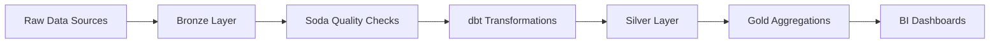

# 🏗️ Data Lakehouse Project Plan
*Building a Modern Data Platform with DuckDB, dbt, and MinIO*

---

## 📋 Table of Contents
- [🎯 Learning Objectives](#-learning-objectives)
- [🛠️ Technology Stack](#️-technology-stack)
- [📊 Data Domain](#-data-domain)
- [🏛️ System Architecture](#️-system-architecture)
- [⚡ Workflow](#-workflow)
- [📁 Project Structure](#-project-structure)
- [🚀 Implementation Phases](#-implementation-phases)
- [📈 Monitoring & Logging](#-monitoring--logging)
- [⏰ Timeline & Milestones](#-timeline--milestones)
- [⚠️ Risks & Assumptions](#️-risks--assumptions)
- [✅ Success Criteria](#-success-criteria)

---

## 🎯 Learning Objectives

### Core Architecture Understanding
- **Medallion Architecture**: Master Bronze → Silver → Gold data layers
- **Object Storage**: Learn S3-compatible storage with MinIO
- **Data Processing**: Hands-on with DuckDB + dbt transformations
- **Data Quality**: Implement quality frameworks with Soda Core
- **Orchestration**: Schedule jobs with Airflow (or simple cron)

### Technical Skills
- **Data Ingestion**: Raw data handling in Parquet format
- **ETL/ELT**: Transform and aggregate data pipelines
- **Quality Assurance**: Automated data validation
- **Infrastructure**: Docker-based development environment

---

## 🛠️ Technology Stack

| Component | Technology | Purpose |
|-----------|------------|---------|
| **Object Storage** | MinIO (S3-compatible) | Raw data lake storage |
| **Compute Engine** | DuckDB | Fast analytical queries |
| **Transformation** | dbt-duckdb | Data modeling & transformation |
| **Data Quality** | Soda Core | Automated quality checks |
| **BI Tool** | Apache Superset / Metabase | Data visualization |
| **Orchestrator** | Airflow (optional) | Job scheduling |

---

## 📊 Data Domain

### Mini E-commerce Orders Dataset
*Perfect for learning lakehouse concepts with realistic business scenarios*

**📥 Data Sources:**
- Historical file (UCI Online Retail II or public e-commerce CSV)
- Daily mock data generator for micro-batch simulation

**📋 Raw Tables (Bronze Layer):**
- `orders` - Order transactions
- `products` - Product catalog
- `customers` - Customer information
- `fx_rates` (optional) - Currency exchange rates

**📏 Data Scale:**
- **Volume**: 100K–1M rows (optimal for DuckDB performance)
- **Velocity**: Daily micro-batches
- **Variety**: Structured transactional data

---

## 🏛️ System Architecture

### Data Lakehouse Layers

#### 🥉 Bronze Layer (Raw Data)
*Landing zone for raw, unprocessed data*

**Characteristics:**
- **Data State**: Raw, immutable data from sources
- **Format**: Parquet for efficient storage
- **Storage**: MinIO S3-compatible object storage
- **Processing**: No transformations, ingest as-is
- **Purpose**: Historical archive, audit trail

#### 🥈 Silver Layer (Cleaned Data)
*Validated, standardized, and enriched data*

**Characteristics:**
- **Data State**: Cleaned, normalized business data
- **Processing**: dbt-duckdb transformations
- **Validation**: Business logic rules applied
- **Quality**: Soda Core automated checks
- **Purpose**: Single source of truth for business

#### 🥇 Gold Layer (Aggregated Data)
*Business-ready analytics and reporting*

**Characteristics:**
- **Data State**: Aggregated metrics, KPIs, dimensions
- **Processing**: Pre-computed aggregations
- **Optimization**: Query performance optimized
- **Consumption**: BI tools, dashboards, reports
- **Purpose**: Fast analytics and business intelligence

---

## ⚡ Workflow

### 🔄 Daily Data Pipeline


**Pipeline Steps:**
1. **📥 Ingest**: Raw data → Bronze (cron/Airflow)
2. **🔍 Validate**: Quality checks with Soda Core
3. **🔄 Transform**: Bronze → Silver via dbt
4. **📊 Aggregate**: Silver → Gold for analytics
5. **📈 Report**: Generate insights & alerts

### 🛠️ Development Workflow

**Version Control & Collaboration:**
- **Git**: Code versioning and collaboration
- **Docker**: Consistent development environment
- **Testing**: dbt tests + Soda quality checks
- **CI/CD**: Automated deployment (optional)

---

## 📁 Project Structure

```
lakehouse-project/
├── 🐳 docker/
│   ├── docker-compose.yml
│   ├── minio/
│   └── airflow/ (optional)
├── 💾 data/
│   ├── bronze/          # Raw data
│   ├── silver/          # Cleaned data
│   └── gold/            # Analytics data
├── 🔄 dbt/
│   ├── models/
│   │   ├── staging/     # Bronze → Silver
│   │   ├── intermediate/ # Silver processing
│   │   └── marts/       # Gold layer
│   ├── tests/           # Data quality tests
│   ├── macros/          # Reusable functions
│   └── dbt_project.yml
├── ✅ soda/
│   ├── configuration.yml
│   ├── checks.yml
│   └── data_source.yml
├── 📜 scripts/
│   ├── ingest_data.py   # Data ingestion
│   ├── generate_data.py # Mock data generator
│   └── setup.sh         # Environment setup
├── 🎯 airflow/dags/     # Workflow orchestration
├── 📓 notebooks/        # Exploratory analysis
└── 📚 docs/             # Documentation
```

---

## 🚀 Implementation Phases

### Phase 1: Infrastructure Setup *(1-2 days)*
**Foundation & Environment**
- 🐳 Setup Docker development environment
- 💾 Configure MinIO S3-compatible storage
- 📦 Install DuckDB, dbt-duckdb, Soda Core
- 📁 Create standardized project structure

### Phase 2: Data Ingestion *(2-3 days)*
**Bronze Layer Implementation**
- 🎲 Create realistic mock data generator
- 📥 Build data ingestion scripts
- 💾 Implement Bronze layer storage
- 🧪 Test end-to-end data loading pipeline

### Phase 3: Data Transformation *(3-4 days)*
**Silver Layer Development**
- 🔄 Setup and configure dbt project
- 🏗️ Create staging models (Bronze → Silver)
- 🔧 Implement business logic transformations
- ✅ Add comprehensive Soda quality checks

### Phase 4: Analytics Layer *(2-3 days)*
**Gold Layer & BI**
- 📊 Build Gold layer aggregations & metrics
- 🎨 Create analytical views and dimensions
- 📈 Setup BI tool (Superset/Metabase)
- 📋 Generate sample reports and dashboards

### Phase 5: Production Ready *(2-3 days)*
**Orchestration & Monitoring**
- 🎯 Setup Airflow DAGs for scheduling
- 📊 Implement comprehensive monitoring
- 🚨 Add alerting and error handling
- ⚡ Performance optimization and tuning

---

## 📈 Monitoring & Logging

### Data Quality Monitoring
- **✅ Automated Checks**: Soda Core validation per layer
- **🚨 Alert System**: Immediate notification on quality issues
- **⏰ Freshness Monitoring**: Data timeliness validation
- **🔍 Schema Validation**: Structure consistency checks

### System Monitoring
- **📊 Pipeline Status**: Execution tracking and reporting
- **💾 Storage Metrics**: MinIO usage and capacity monitoring
- **⚡ Performance KPIs**: Query speed and resource utilization
- **🐛 Error Tracking**: Comprehensive logging and troubleshooting

---

## ⏰ Timeline & Milestones

| Week | Phase | Key Deliverables | Status |
|------|-------|------------------|--------|
| **1** | Infrastructure & Ingestion | Docker/MinIO setup, data generator, Bronze layer | ✅ |
| **2** | Data Transformation | dbt project, Silver models, Soda checks | ✅ |
| **3** | Analytics & BI | Gold aggregations, BI dashboard, sample reports | ✅ |
| **4** | Production Ready | Orchestration, monitoring, documentation | ✅ |

**Total Timeline: 4 weeks** | **Effort: Part-time learning project**

---

## ⚠️ Risks & Assumptions

### Assumptions
- ✅ Local development environment with Docker
- ✅ Basic SQL and Python programming knowledge
- ✅ Access to sample e-commerce datasets
- ✅ Stable internet connection for package downloads

### Potential Risks
- ⚠️ **Performance**: DuckDB scalability with large datasets (>1M rows)
- ⚠️ **Storage**: MinIO limitations in local Docker environment
- ⚠️ **Network**: Latency issues in containerized setup

### Mitigation Strategies
- 📈 **Gradual Scaling**: Start small, monitor performance metrics
- 🔍 **Proactive Monitoring**: Track resource usage and bottlenecks
- ☁️ **Cloud Migration**: Plan for AWS S3/GCS when scaling needed

---

## ✅ Success Criteria

### Technical Excellence
- **🔄 Reliability**: Pipeline runs consistently daily
- **🎯 Quality**: >95% data accuracy across all layers
- **⚡ Performance**: <5s query response on Gold layer
- **🧪 Testing**: 100% test coverage for transformations

### Learning Outcomes
- **🏗️ Architecture**: Deep understanding of medallion pattern
- **🔄 dbt Mastery**: Proficient in data transformation workflows
- **✅ Quality Frameworks**: Hands-on experience with Soda Core
- **💾 Storage**: Practical knowledge of object storage systems

### Business Impact
- **📊 Insights**: Generate meaningful business analytics
- **📈 Dashboards**: Create interactive reporting interfaces
- **🔄 Automation**: Streamlined reporting workflows
- **📈 Scalability**: Foundation for enterprise data platform